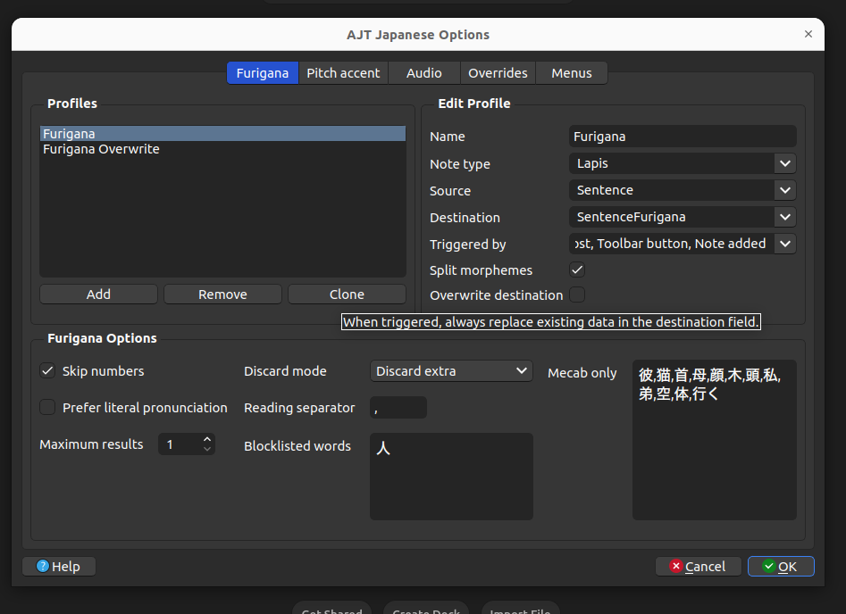
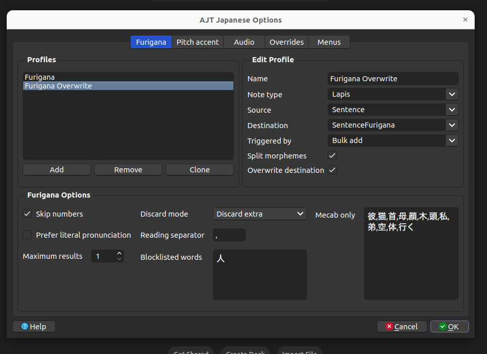

# AJT Japanese setup

> **Note:** This guide only covers how to set up AJT Japanese for use with Lapis.

AJT Japanese is an Anki add-on, and the version maintained by arbyste is recommended. Check [here](#why-do-you-use-the-arbyste-version) to find out why. You can download it [here](https://ankiweb.net/shared/info/200813220). After installing the add-on, restart Anki to see **AJT** in the top bar.

1. **Setting up automatic furigana for the sentence field**  
   Click on `AJT` in the top bar, then select `Furigana`. Make sure your settings match the following:

   

     
     
<em>Focus mainly on the Edit Profile section</em>

   

   Click `OK` to save your settings. That's it!

   *Optional:* If you use tools like [asbplayer](https://killergerbah.github.io/asbplayer/) or [mpvacious](https://github.com/Ajatt-Tools/mpvacious), follow the next step.

2. **Handling furigana after mining with tools like asbplayer or mpvacious**  
   If you update the `Sentence` field after mining with these tools, the settings above won’t automatically regenerate the `SentenceFurigana` field, which can cause rendering issues. To avoid this, bulk-regenerate furigana after each mining session. First, create an additional profile in AJT:

   3. Click `AJT`, then `Profiles` and then `Add`, then match your settings to the following:

   

     
     
<em>Note how `Overwrite Destination` and `Triggered by` in the `Edit Profile` differ from the first profile we set up.</em>

   

   Save the profile and restart Anki. After mining, open `Browse`, select the cards, go to `Edit` in the top bar, and select `AJT: Bulk-generate`. This will overwrite the furigana field only when you run the bulk-generate command.

   *Tip:* To easily find cards mined today, either move them to a separate deck before generating furigana or use the search term `added:1` in the search bar.

### Why do you use arbyste's version?

There are two main reasons:

1. **Stability** – Arbyste's version avoids any breaking changes introduced by the AJT mainstream. According to the JPMN fork description:

   > This is a fork of AJT Japanese, intended to provide a stable version of the add-on for anyone using the JP Mining Note Japanese note type.

   While it's designed for JPMN, it works just as well with Lapis.

2. **Cleaner Furigana** – The AJT mainstream version generates all possible readings of a word in the Furigana field, which can clutter and bloat the cards.
