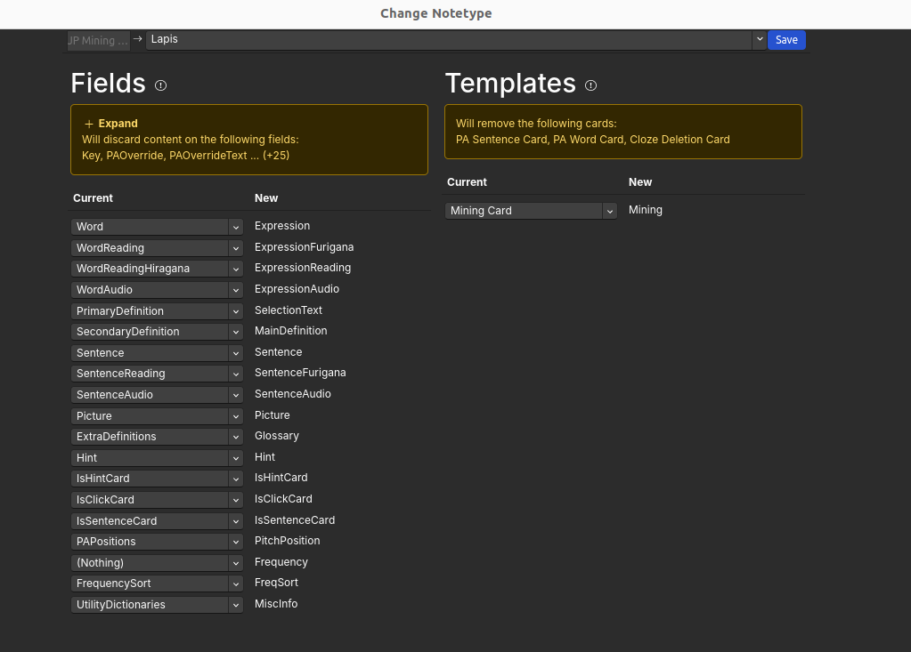

# Updating Cards from JPMN

> **Note:** This guide is specifically for those updating from JPMN to Lapis. 

To switch your cards from JPMN to Lapis, open `Browse`, select all the JPMN cards you want to switch, and press `Ctrl+Shift+M` to open the `Change Notetype` menu. Then, match the fields as shown below:

 

You can experiment with other cards as well. The dictionary and pitch accent fields may need adjustments based on your preferences and mining habits, but please proceed at your own risk or discretion.